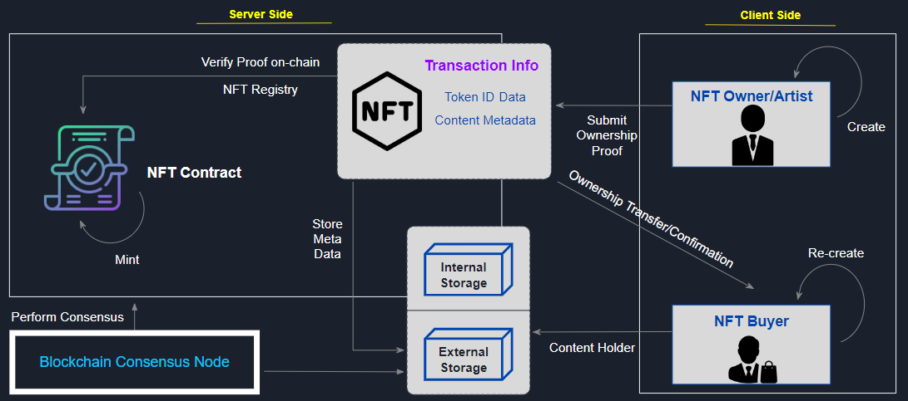
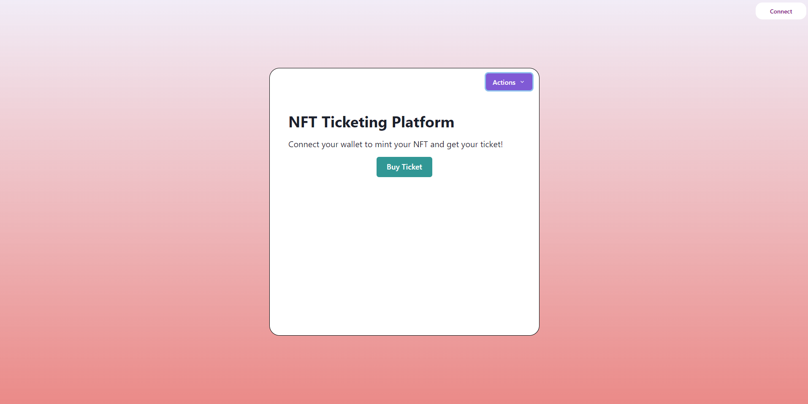
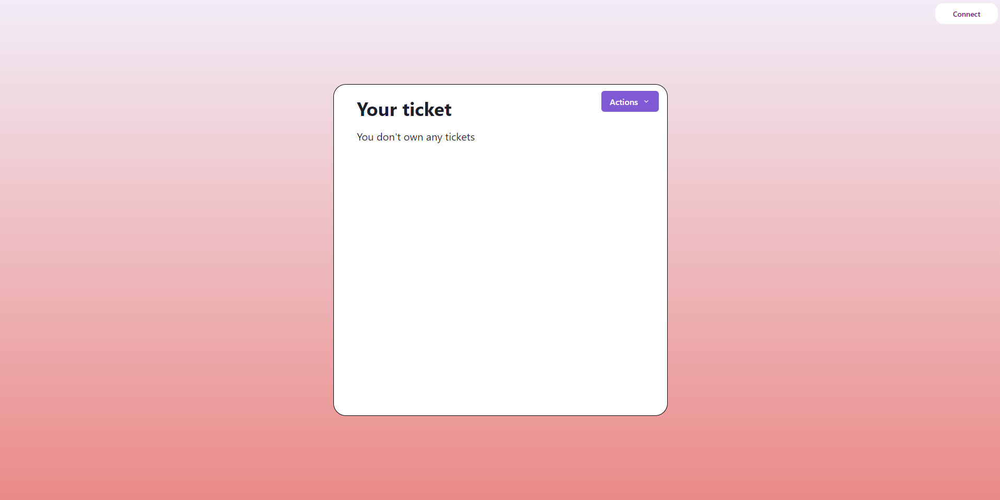
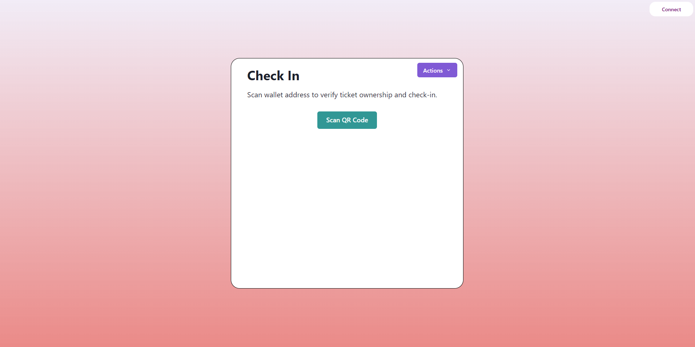
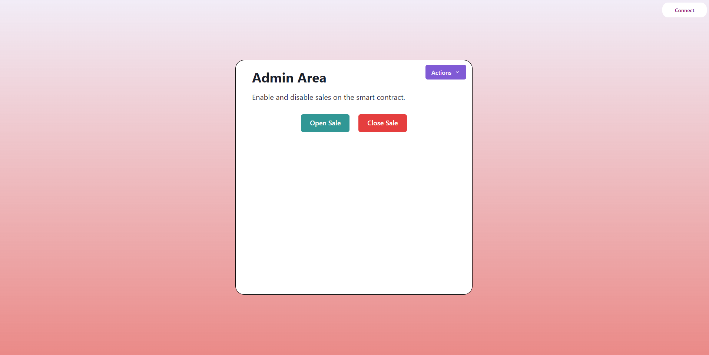
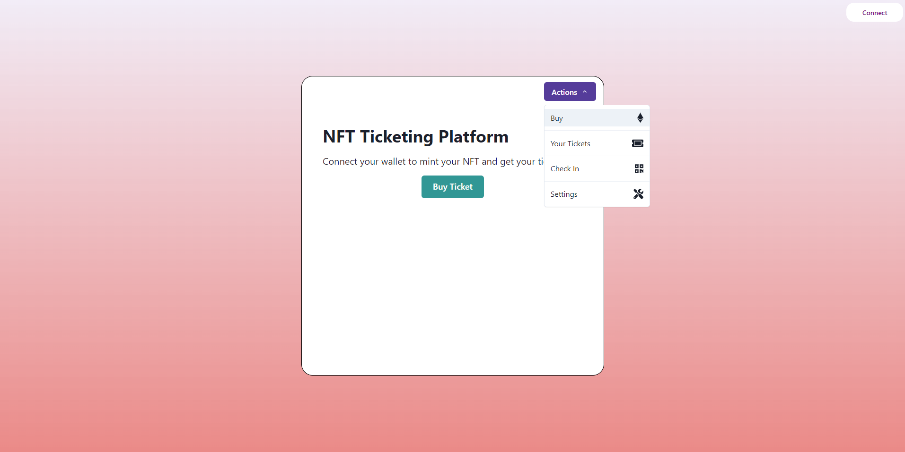

# Capstone Project: NFT Ticketing

## Setup

1. clone the project

```bash
git clone
```

2. Install all dependencies

```bash
npm install
```

3. Install hardhat

```bash
npm install --save-dev hardhat
```

4. Install Metamask

5. Run the project

```bash
npm start
```

## NFT Ticketing

- Problem statement
  - A ticket is either a barcoded PDF file or a piece of paper with a barcode, so entertainment companies cannot access their customers' information. Since fraudsters are a significant concern in the secondary market because they take advantage of the lack of pricing transparency and the limited number of tickets, the secondary market is fraught with danger.

- Goals
  - NFT enable event organizers to reduce the time and resources required to produce tickets for specific events.
  - When an event is over, those NFT tickets can be sold or collected as collectibles, and certain event organisers will provide the collectors with an item for future events.
  - NFT provide a secure and safety experience for buyers and sellers.

- Stakeholders
  - Original & Secondary NFT ticket buyers
  - Event organizers
  - Marketers

- Exceptions
  - Event organizers can utilize the ticketing system to produce the required number of NFT tickets on their choice of a blockchain platform.
  - Customers acquire NFT tokens and store them in mobile-device-accessible wallets.
  - Event organizers or artists can configure royalty splits to automatically direct a percentage of money from all secondary resales.

- User stories
  - As a fan of this entertainment event, the user wants to be able to use a smart contract to purchase a NFT ticket to an event, so that the user can be sure that their ticket is valid and that they can easily transfer it to a friend or sell it on the secondary market if necessary.
  - The user can click the connect MetaMask button to connect to their MetaMask account.
  - The user can click the dropdown menu to choose to buy a ticket from either the primary market or the secondary market.
  - The user can sell their unused ticket by selecting the sell link from the dropdown menu.
  - The user can click the button to purchase the ticket through metamask account.
  - The user can also click the button to sell the ticket using metamask to recieve funds.

## Architecture

- Project description
  - An dApp allows user to buy NFT ticket.

- Functions
  - User first connect to their metamask wallet by clicking the connect button or scan their QR code.
  - User interacts with the actions dropdown menu to select which action they want.
  - User interacts with our dApp which will allow our user to purchase an NFT tickets.
  - User can check if they own any ticket by clicking "Your Tickets" from the dropdown menu.
  - User can scan wallet address to verify ticket ownership and check-in.
  - User can enable and disable sales on the smart contract.

- How NFT Works


- UI Sceenshots




